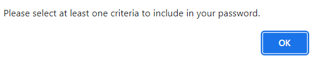

# Password Generator

## Project Summary

This project enables employees, with access to sensitive data, to generate random passwords based on criteria that they’ve selected and which provides greater security. `HTML` and `CSS` were coded by a third party and only `Javascript` was used here to create the functionality for generating passwords.

## Deployed Page and Repository

[Deployed page](https://nsharma-uk.github.io/password-generator/)

[Repository](https://github.com/nsharma-uk/password-generator)

## Technologies

- HTML
- CSS
- JavaScript
- GitHub

## Project Details - User Story

```AS AN employee with access to sensitive data

I WANT to randomly generate a password that meets certain criteria
SO THAT I can create a strong password that provides greater security
```

## Project Details - Acceptance Criteria

```GIVEN I need a new, secure password
WHEN I click the button to generate a password
THEN I am presented with a series of prompts for password criteria
WHEN prompted for password criteria
THEN I select which criteria to include in the password
WHEN prompted for the length of the password
THEN I choose a length of at least 8 characters and no more than 128 characters
WHEN asked for character types to include in the password
THEN I confirm whether or not to include lowercase, uppercase, numeric, and/or special characters
WHEN I answer each prompt
THEN my input should be validated and at least one character type should be selected
WHEN all prompts are answered
THEN a password is generated that matches the selected criteria
WHEN the password is generated
THEN the password is either displayed in an alert or written to the page
```

## Screenshots

<details>
  <summary>Deployed page</summary>


</details>

<details>
  <summary>Prompt asking for input of chosen password length</summary>


</details>

<details>
  <summary>Prompt asking if user wants lowercase in their password</summary>


</details>

<details>
  <summary>Alert message telling user that they need to select at least one criteria.</summary>



</details>

<details>
  <summary>Password generated - 10 characters, all criteria used</summary>


</details>

## Authored by

Nayan Sharma

## Contact

Email: nsharma711@gmail.com  
GitHub: [github.com/nsharma-uk](https://github.com/nsharma-uk)
LinkedIn: [nsharma-uk](https://linkedin.com/in/nsharma-uk)
